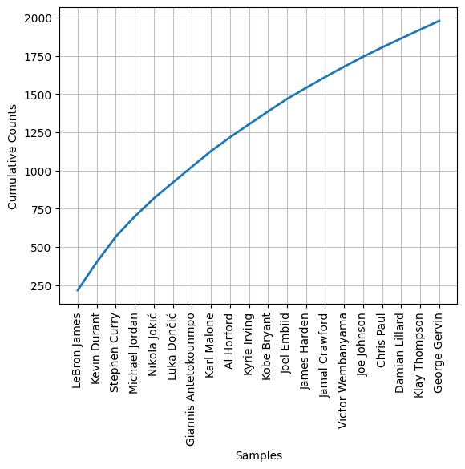
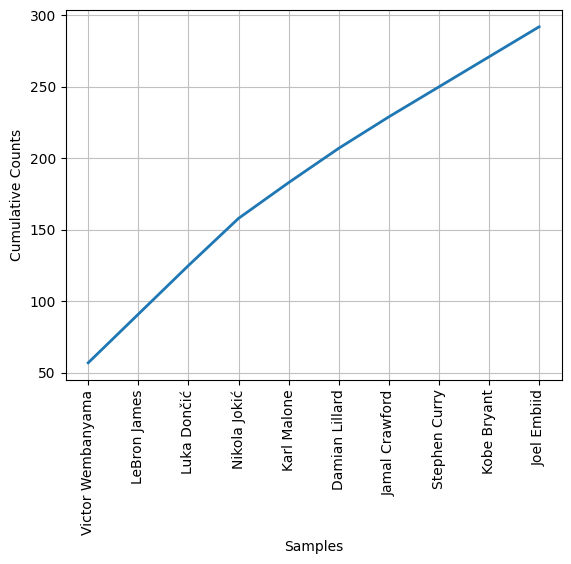

# MostMentionedPlayerNBA

## Introduction

This project aims to determine the most mentioned players in articles from the `nba.com` website for the period from 12.10.2020 to 07.03.2024. For this purpose, I extracted the **id**, **title**, **excerpt** and **date** of the last 10000 articles from the website. Further using `nltk` I will determine the most mentioned players in fragments of these articles: 
1. I break the excerpt into words and clean it from such words as *in*, *is*, and *an*.
2. Using `StanfordPOSTagger`, I extract words with the tag **PERSON** from the fragment and add them to the person list.
3. I process the list as follows: replace **Nikola** with **Nikola Jokic** and **Victor** with **Victor Wembanyama** (these are the most obvious cases where `StanfordPOSTagger` made a mistake and didn't fully recognize the person, because sometimes it didn't see the last name, and sometimes it designated the first name and last name as two different people, I still take into account adding the same player twice in the previous step), and further search on `basketball-reference.com` for the player who was determined by `StanfordPOSTagger` (to unify and check if it determined everything correctly, and also with such an action instead of adding **Bryant** to the final list after the search it will add **Kobe Bryant**, so on the one hand it could have been not Kobe but Thomas Bryant, but I think that the probability of Kobe's appearance in the article is much higher), moreover I withdraw the names of the teams from the list (I also pulled this list from `basketball-reference.com`).
4. Finally, I remove such players as **]** , **Kia Nurse**, **Dan Issel**, **Jeff Halliburton**, **Rudy LaRusso**, **John Brisker** and **Lenny Wilkens**) because they are wrongly added players, for example **Kia Nurse** - a very cool canadian basketball player, but unfortunately she ended up here because the car manufacturer **KIA** is the sponsor of the MVP award, and `StanfordPOSTagger` determined **KIA** as a person, and then a search on `basketball-reference.com` recognized this person as **Kia Nurse**.
5. Well, and in the retest we determine the frequency distribution for 100 with a chart for 20.

The entire analysis progress in this [file](nba.ipynb)

## Results

As expected, the most mentioned player for this period is **LeBron James** (sorry, but GOAT for me, I'm too young and didn't see Jordan play). Next go KD, Steph, MJ and so on. The only thing I'm surprised about is that Victor Wembanyama is already ranked as high as 16th, and he hasn't even completed his first season in the **NBA**. It became interesting to see where he would be if we explored who is the most mentioned starting from the end of the previous play-off.

| Player             | Number of mentions |
|--------------------|--------------------|
| Victor Wembanyama  | 57                 |
| LeBron James       | 34                 |
| Luka Dončić        | 34                 |
| Nikola Jokić       | 33                 |
| Karl Malone        | 25                 |
| Damian Lillard     | 24                 |
| Jamal Crawford     | 22                 |
| Stephen Curry      | 21                 |
| Kobe Bryant        | 21                 |
| Joel Embiid        | 21                 |

And in this period Victor Wembanyama is the most frequently mentioned player, which can't help but impress, especially since he deserves so much attention, at least he's already done **5-by-5**, has a little more than **60% true shooting** since the beginning of the year, and still a lot of different very rare things for a rookie.
